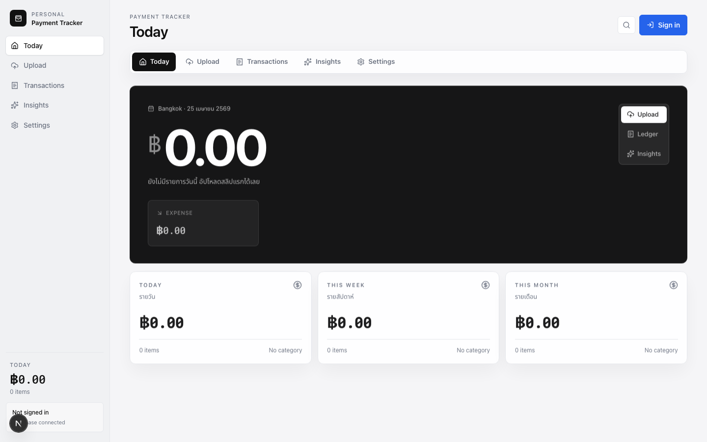
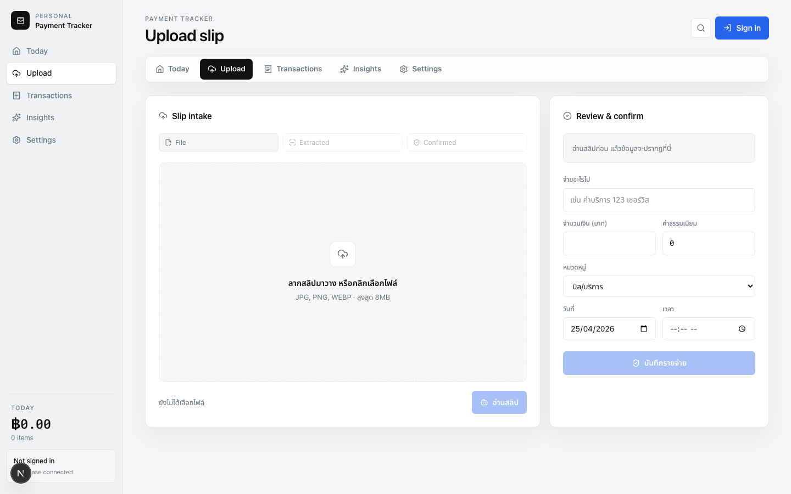

# Payment Tracker

Payment Tracker เป็นเว็บแอปสำหรับบันทึกรายรับรายจ่ายจากสลิปธนาคารไทย โดย flow หลักคือให้ผู้ใช้ upload สลิป, ระบบทำ OCR ใน browser, ส่งข้อความ OCR ให้ NVIDIA DeepSeek V4 Flash ช่วยดึงข้อมูลเป็น JSON, แล้วให้ผู้ใช้ตรวจเองก่อนบันทึกลง Supabase

โปรเจคนี้ตั้งใจทำแบบ confirmation-first: AI ช่วยกรอก แต่ผู้ใช้เป็นคนยืนยันก่อน save จริง

## Screenshots

### Dashboard



### Upload slip



## Tech Stack

- Framework: Next.js 16 App Router
- UI: React 19, TypeScript, Tailwind CSS 4
- Auth: Supabase Auth, Google OAuth
- Database: Supabase Postgres with Row Level Security
- OCR: tesseract.js running in browser
- AI parsing: NVIDIA API, model `deepseek-ai/deepseek-v4-flash`
- Validation: Zod
- Security: CSP proxy, CSRF double-submit cookie, Same-Origin guard, rate limiting, encrypted sensitive transaction fields

## Main Flow

```text
User uploads slip image
  -> Browser validates file and previews image
  -> tesseract.js reads text from image in browser
  -> API receives original file metadata plus OCR text
  -> Server validates auth, CSRF, origin, rate limit, file MIME, file signature
  -> NVIDIA DeepSeek V4 Flash parses OCR text into structured JSON
  -> User reviews amount/date/reference/category
  -> Server encrypts sensitive fields
  -> Supabase saves transaction under the signed-in user
```

Important: `deepseek-ai/deepseek-v4-flash` is used as a text model. It does not read slip images directly. The image reading step is handled by OCR first.

## Features

- Google login through Supabase Auth
- Upload slip image in JPG, PNG, or WEBP format
- File size limit: 8 MB
- Magic-byte validation for uploaded image content
- Browser-side OCR with Thai and English language data
- NVIDIA DeepSeek parsing from OCR text
- Review and confirm before save
- Duplicate slip protection through `reference_no_hash`
- Daily, weekly, and monthly spending summaries
- Category breakdown
- Private Supabase rows per user through RLS
- Private Supabase storage bucket for slips
- Encrypted transaction sensitive fields before DB insert

## Repository Structure

```text
src/
  app/
    api/
      slips/process/route.ts        # Validate upload + parse OCR text with NVIDIA DeepSeek
      transactions/route.ts         # Load/save transactions
      summaries/daily/route.ts      # Local summary endpoint
      cron/daily-summary/route.ts   # Protected cron placeholder
    app/page.tsx                    # Dashboard app route
    upload/page.tsx                 # Upload page
    transactions/page.tsx           # Ledger page
    insights/page.tsx               # Insights page
    settings/page.tsx               # Settings page
  components/
    payment-tracker-app.tsx         # Main client UI and OCR flow
  lib/
    ai/slip-extraction.ts           # NVIDIA DeepSeek text parsing
    security/api.ts                 # CSRF, origin, rate limit, JSON helpers
    security/encryption.ts          # AES-256-GCM encryption and HMAC hash
    security/upload.ts              # File metadata and signature validation
    supabase/client.ts              # Browser Supabase client
    supabase/server.ts              # Server auth helpers
supabase/
  migrations/
    001_initial_schema.sql
    002_storage_rls_hash.sql
    003_rate_limits.sql
    004_transaction_reference_hash.sql
public/
  product-dashboard.png
  product-upload.png
```

## Prerequisites

- Node.js 20+
- npm
- Supabase project
- Google Cloud OAuth client
- NVIDIA API key from NVIDIA build/integrate endpoint

## Environment Variables

Create `.env` in the project root.

```env
NEXT_PUBLIC_SUPABASE_URL=https://your-project-ref.supabase.co
NEXT_PUBLIC_SUPABASE_ANON_KEY=your-supabase-anon-key

NVIDIA_API_KEY=nvapi-your-key
NVIDIA_BASE_URL=https://integrate.api.nvidia.com/v1
NVIDIA_SLIP_MODEL=deepseek-ai/deepseek-v4-flash
NVIDIA_SUMMARY_MODEL=nvidia/llama-3.1-nemotron-ultra-253b-v1

INTERNAL_ENCRYPTION_SECRET=replace-with-random-hex
INTERNAL_ENCRYPTION_SALT=replace-with-random-hex

CRON_SECRET=replace-with-random-hex
```

Generate local secrets:

```bash
openssl rand -hex 32
```

Do not commit `.env`. The project `.gitignore` already ignores `.env*` except `.env.example`.

## Local Development

Install dependencies:

```bash
npm install
```

Run the dev server:

```bash
npm run dev
```

Open:

```text
http://localhost:3000
```

If port 3000 is busy, Next.js will choose another port and print it in the terminal.

## Supabase Setup

Run migrations in order:

```text
supabase/migrations/001_initial_schema.sql
supabase/migrations/002_storage_rls_hash.sql
supabase/migrations/003_rate_limits.sql
supabase/migrations/004_transaction_reference_hash.sql
```

If you do not use Supabase CLI, open Supabase Dashboard -> SQL Editor and run each SQL file manually.

The last migration is required because encrypted reference numbers cannot use the old plaintext unique index:

```sql
alter table transactions
add column if not exists reference_no_hash text;

drop index if exists transactions_user_reference_unique;

create unique index if not exists transactions_user_reference_hash_unique
on transactions (user_id, reference_no_hash)
where reference_no_hash is not null;
```

Check that `reference_no_hash` exists before testing save transaction. If this column is missing, saving a transaction will fail.

## Google Login Setup

### 1. Google Cloud

Go to Google Cloud Console -> APIs & Services -> Credentials.

Create:

```text
Create Credentials
-> OAuth client ID
-> Application type: Web application
```

Authorized JavaScript origins:

```text
http://localhost:3000
https://your-vercel-domain.vercel.app
```

Authorized redirect URIs:

```text
https://your-project-ref.supabase.co/auth/v1/callback
```

Copy the generated Client ID and Client Secret.

### 2. Supabase Provider

Go to Supabase Dashboard:

```text
Authentication
-> Providers
-> Google
```

Enable Google and paste:

```text
Client ID
Client Secret
```

### 3. Supabase URL Configuration

Go to:

```text
Authentication
-> URL Configuration
```

For local development:

```text
Site URL:
http://localhost:3000

Redirect URLs:
http://localhost:3000/**
```

For Vercel:

```text
Site URL:
https://your-vercel-domain.vercel.app

Redirect URLs:
https://your-vercel-domain.vercel.app/**
```

The code already calls:

```ts
supabase.auth.signInWithOAuth({
  provider: "google",
  options: { redirectTo: window.location.origin },
});
```

## NVIDIA DeepSeek Setup

This app uses NVIDIA's OpenAI-compatible chat completions endpoint:

```text
https://integrate.api.nvidia.com/v1/chat/completions
```

Model:

```text
deepseek-ai/deepseek-v4-flash
```

DeepSeek receives OCR text, not the image file. The API prompt asks it to return JSON matching this shape:

```json
{
  "document_type": "thai_bank_slip",
  "bank_name": "string or null",
  "status": "success",
  "amount": 1250,
  "fee": null,
  "currency": "THB",
  "transaction_date_iso": "2026-04-25",
  "transaction_time": "14:32",
  "sender_name": null,
  "receiver_name": "string or null",
  "receiver_account_hint": null,
  "reference_no": "string or null",
  "raw_text": "OCR text",
  "confidence": 0.85
}
```

## OCR Notes

OCR runs in the browser using `tesseract.js`.

The browser downloads:

- Tesseract worker from jsDelivr
- Tesseract core from jsDelivr
- Thai and English traineddata from Project Naptha tessdata

CSP in `src/proxy.ts` allows those sources:

```text
https://cdn.jsdelivr.net
https://tessdata.projectnaptha.com
```

Trade-off:

- Pros: free, no OCR API key, slip image does not need to be sent to an OCR provider
- Cons: slower on low-end devices, Thai OCR can be imperfect, user confirmation is still required

## Security Model

Implemented controls:

- Supabase Auth required for write/read APIs
- Same-Origin check for POST endpoints
- CSRF double-submit cookie for POST endpoints
- Rate limiting through Supabase RPC
- Production fails closed if DB-backed rate limit is unavailable
- Request body size limits
- Upload MIME validation
- Upload magic-byte validation
- Private Supabase storage bucket
- RLS on user-owned tables
- CSP with nonce and `strict-dynamic`
- HSTS in production
- Sensitive transaction fields encrypted before DB insert:
  - `title`
  - `bank_name`
  - `receiver_name`
  - `reference_no`
- Duplicate reference detection through HMAC hash:
  - `reference_no_hash`

Important operational note:

- `SUPABASE_SERVICE_ROLE_KEY` is not required by the app runtime.
- Do not put service role key in frontend env.
- Do not expose service role key in Vercel public variables.

## Vercel Deployment

Set these Environment Variables in Vercel:

```text
NEXT_PUBLIC_SUPABASE_URL
NEXT_PUBLIC_SUPABASE_ANON_KEY
NVIDIA_API_KEY
NVIDIA_BASE_URL
NVIDIA_SLIP_MODEL
NVIDIA_SUMMARY_MODEL
INTERNAL_ENCRYPTION_SECRET
INTERNAL_ENCRYPTION_SALT
CRON_SECRET
```

Recommended values:

```text
NVIDIA_BASE_URL=https://integrate.api.nvidia.com/v1
NVIDIA_SLIP_MODEL=deepseek-ai/deepseek-v4-flash
```

Before deploying:

```bash
npm run lint
npm run build
```

After deploying:

1. Add the Vercel domain to Google OAuth Authorized JavaScript origins.
2. Add the Supabase callback URL to Google OAuth Authorized redirect URIs.
3. Add the Vercel domain to Supabase Auth URL Configuration.
4. Confirm all Supabase migrations are applied.

## Testing Checklist

Run locally:

```bash
npm run lint
npm run build
```

Manual test:

1. Open the app.
2. Click Sign in.
3. Login with Google.
4. Upload a Thai bank slip image.
5. Wait for OCR.
6. Wait for DeepSeek extraction.
7. Check amount, date, time, receiver, reference number.
8. Save transaction.
9. Refresh page.
10. Confirm the transaction still loads from Supabase.

Database check:

```sql
select id, user_id, reference_no_hash, created_at
from transactions
order by created_at desc
limit 5;
```

Do not expect readable `title`, `bank_name`, `receiver_name`, or `reference_no` in the DB after encryption is enabled.

## Known Limitations

- Tesseract OCR can misread Thai text, especially from blurry slips.
- DeepSeek parses OCR text only; it does not see the original image.
- The upload flow is optimized for confirmed manual review, not fully automated accounting.
- Existing plaintext transaction rows created before encryption may need migration if they exist in production data.
- `npm audit` currently reports a moderate advisory through Next.js' nested PostCSS dependency. Do not run `npm audit fix --force` blindly because it suggests a breaking downgrade path. Track the Next.js patch instead.

## Useful Commands

```bash
npm install
npm run dev
npm run lint
npm run build
```

## Current Production Readiness

Ready for MVP testing after:

1. Supabase migrations are applied.
2. Google OAuth is configured.
3. Vercel env vars are set.
4. A real slip upload is tested end to end.

Not ready for unattended financial automation. The intended behavior is AI-assisted extraction with human confirmation.
